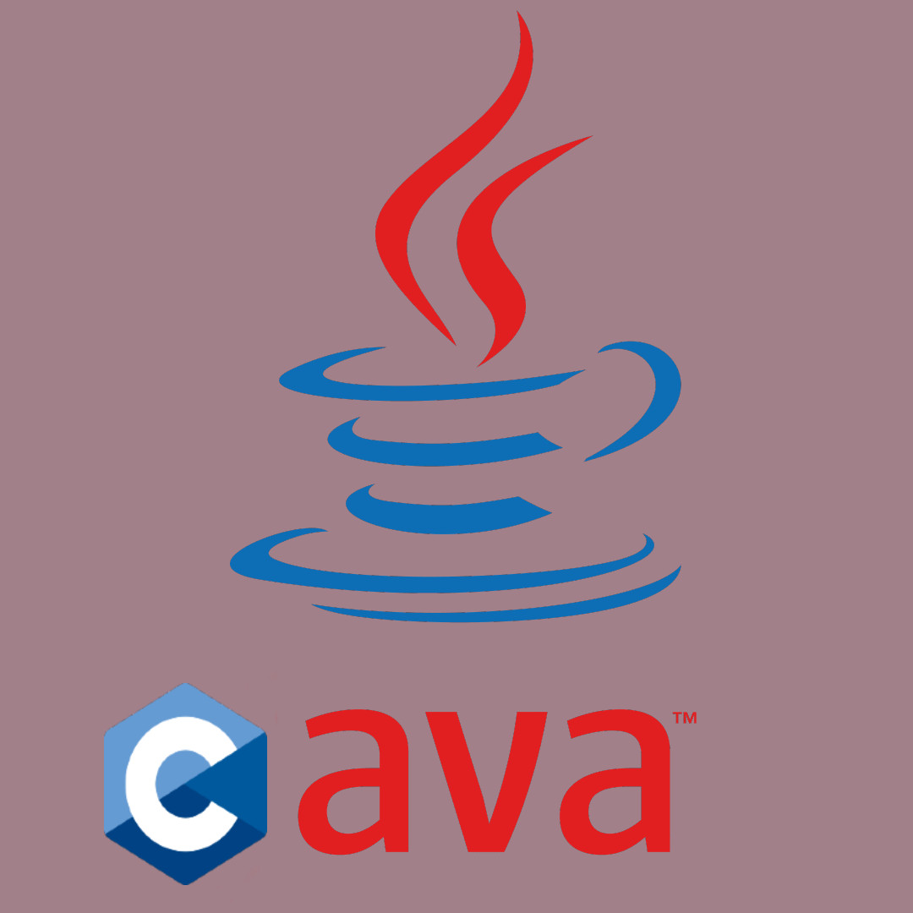

# CVM

A toy Java Virtual Machine coded in C

## Referances / Docs
* [Oracle's JVM Spec](https://docs.oracle.com/javase/specs/jvms/se14/html/)
* [Implementing a Simple JVM in Rust by Ben Evans](https://www.youtube.com/watch?v=7ECbwgkHdAE&ab_channel=Devoxx)
* [zserge - How to write a (toy) JVM](https://zserge.com/posts/jvm/)
